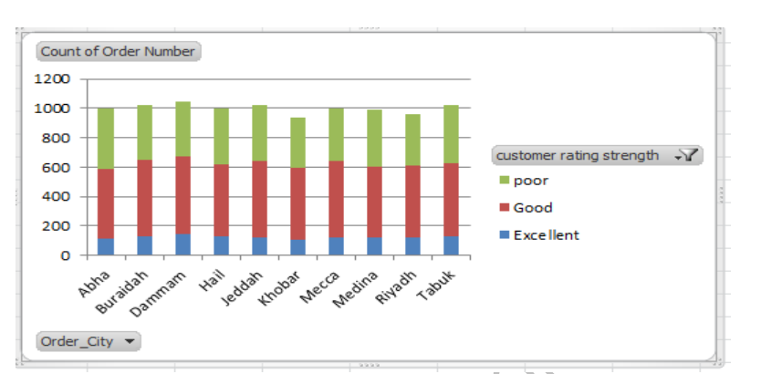
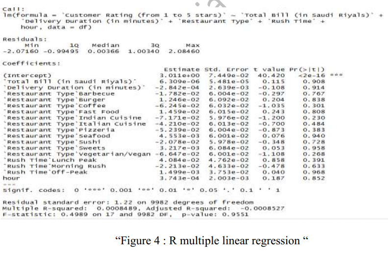
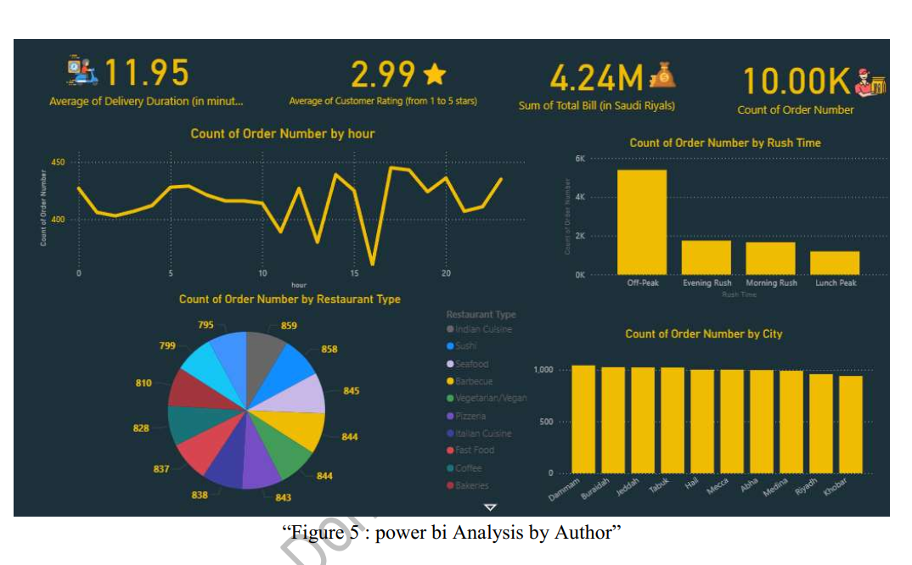

# Saudi Q-Commerce & Food Delivery Market Analysis

## Overview

This project combines market research, exploratory data analysis, statistical modeling, and business intelligence to examine Saudi Arabia's Q-commerce and food delivery market.

The project was developed using **Excel, R, and Power BI**, combining strategic market analysis with a dataset of 10,000 food-delivery orders.

## Business Objective

The project aims to:

- Understand the competitive landscape of Saudi Arabia's Q-commerce market.
- Explore customer ordering behavior across cities, restaurant types, and time periods.
- Examine whether operational factors such as delivery duration and order characteristics are associated with customer ratings.
- Translate analytical findings into business insights.

## Dataset

The analytical dataset contains approximately **10,000 food-delivery orders from 2022–2025**.

Main variables include:

- Order date and time
- City
- Restaurant type
- Total bill (SAR)
- Delivery duration
- Customer rating

Additional variables were created in Excel, including:

- Weekday
- Hour
- Rush-time category
- Bill category
- Customer-rating category

## Tools

- **Excel** — Data preparation, calculated variables, Pivot Tables and exploratory analysis
- **R** — Multiple linear regression
- **Power BI** — Dashboard and visualization
- **Market Research** — Competitive and industry analysis

---

## Exploratory Analysis

The dataset generated several descriptive findings:

- Total billing was approximately **SAR 4.24 million**.
- Average delivery duration was approximately **11.95 minutes**.
- Average customer rating was approximately **3 out of 5**.
- Off-peak periods represented the largest share of orders.
- Order activity remained relatively distributed across the ten cities represented in the dataset.

### Excel Analysis

---

## Statistical Analysis

A multiple linear regression model was developed in R to examine whether customer ratings were associated with:

- Total Bill
- Delivery Duration
- Restaurant Type
- Rush Time
- Hour

The model produced an **R² of approximately 0.001**, indicating that the variables included in the model explained very little of the observed variation in customer ratings.

None of the operational predictors showed conventional statistical significance in the model.

### Interpretation

The low explanatory power of the model suggests that important factors associated with customer satisfaction may not be represented in the dataset.

Possible factors worth investigating in future analyses include:

- Order accuracy
- Food quality and freshness
- Packaging quality
- Customer-service experience

These variables were not available in the analyzed dataset and therefore were not directly tested in this project.

---

## Power BI Dashboard

The dashboard summarizes the main operational findings from the 10,000-order dataset.

---

## Key Takeaways

- Customer ordering activity extends beyond traditional meal-time peaks.
- Customer ratings were relatively stable across the operational dimensions analyzed.
- Delivery duration showed almost no linear correlation with customer rating.
- The regression results indicate that the available operational variables provide very limited explanatory power for customer satisfaction.
- Combining market intelligence with operational data can provide a broader view of a highly competitive Q-commerce market.

---

## Limitations

This project should be interpreted as an exploratory business-analysis case study.

The available dataset does not contain several qualitative customer-experience variables that could potentially help explain customer ratings.

The analysis identifies patterns and statistical associations but does not establish causal relationships.

## Author

**Mostafa Soliman Donia**
